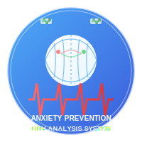

# 불안장애 예방 시스템 (Anxiety Prevention Device)

<div align="center">
  
</div>

웨어러블 심전도 센서로부터 측정된 심박변이도(HRV) 데이터를 분석하여 불안장애 발생 가능성을 예측하고, 두개전기자극을 통해 예방하는 시스템입니다.

[](https://github.com/JJshome/AnxietyPreventionDevice/commits/main)
[](#라이센스)
[](#요구사항)
[](#docker를-사용한-배포)

## 시스템 개요

본 시스템은 다음 특허 기술을 기반으로 구현되었습니다:

- 불안장애 예방장치 (공개특허 10-2022-0007209)
- 저주파 자극기 제어장치 (등록특허 10-2459338)

<div align="center">
  
</div>

### 주요 기능

- **심전도 모니터링**: 웨어러블 장치를 통한 실시간 심전도 신호 수집
- **HRV 분석**: 심박변이도 실시간 분석을 통한 불안장애 발생 가능성 예측
- **두개전기자극**: 불안장애 예방을 위한 저주파 전기 자극 제공
- **스테레오 자극**: 두 개 이상의 자극기를 통한 위상차 있는 자극 제공
- **모바일 앱 제어**: 스마트폰 앱을 통한 시스템 제어 및 모니터링
- **실시간 모니터링**: 웹 대시보드를 통한 불안 지표 및 자극 상태 실시간 모니터링

## 시스템 아키텍처

```
+-----------------------+  +------------------------+  +------------------------+
| 웨어러블 심전도 센서 | -> | HRV 분석 및 예측 모듈 | -> | 두개전기자극 신호 생성 |
+-----------------------+  +------------------------+  +------------------------+
           ^                          |                           |
           |                          v                           v
+------------------------+  +------------------------+  +------------------------+
| 모바일 애플리케이션   | <- |         데이터베이스    | <- | 저주파 자극기(2+)      |
+------------------------+  +------------------------+  +------------------------+
           ^                          ^
           |                          |
+------------------------+            |
| 웹 대시보드 서버      | <-----------+
+------------------------+
```

## 기술 스택

- **하드웨어**: 웨어러블 심전도 센서, 저주파 자극기
- **백엔드**: Python (신호 처리, HRV 분석), Flask (API 서버)
- **프론트엔드**: HTML, CSS, JavaScript, Chart.js
- **모바일 앱**:
  - Android: Kotlin
  - iOS: Swift
- **통신**: Bluetooth (센서 및 자극기 연결), WebSocket (실시간 데이터), REST API
- **데이터 저장**: MongoDB, SQLite
- **배포**: Docker, Docker Compose

## 심박변이도(HRV) 분석 기술

<div align="center">
  
</div>

본 시스템은 심박변이도(Heart Rate Variability, HRV) 분석을 통해 자율신경계 균형을 평가하고 불안장애 발생 가능성을 예측합니다. 주요 HRV 지표로는 SDNN, RMSSD, pNN50, LF/HF 비율 등을 활용합니다.

## 스테레오 자극 기술

<div align="center">
  
</div>

특허 기술(10-2459338)을 적용한 저주파 자극기 제어장치는 두 개 이상의 자극기에 서로 다른 위상의 신호를 인가합니다. 위상차(0.1초~1초)를 조절하여 스테레오 자극 효과를 극대화할 수 있습니다.

## 주요 구성요소

- **ECG Sensor Interface**: 심전도 센서와의 통신 및 데이터 수집
- **HRV Analyzer**: 심박변이도 분석 및 불안장애 발생 가능성 예측
- **Anxiety Predictor**: 기계학습 기반 불안 수준 예측 모델
- **Stimulation Controller**: 저주파 자극기 제어 및 신호 생성
- **Web Dashboard**: 실시간 모니터링 및 제어를 위한 웹 인터페이스
- **Mobile App**: 사용자 인터페이스 및 시스템 제어

## 설치 및 사용 방법

### 요구사항

- Python 3.8+
- Docker 및 Docker Compose (배포 환경)
- MongoDB (선택 사항)

### 로컬 개발 환경 설정

```bash
# 저장소 복제
git clone https://github.com/JJshome/AnxietyPreventionDevice.git
cd AnxietyPreventionDevice

# 가상 환경 설정
python -m venv venv
source venv/bin/activate
# Windows: venv\Scripts\activate

# 의존성 설치
pip install -r requirements.txt

# 시뮬레이션 실행
python simulation/run_simulation.py
```

### Docker를 사용한 배포

```bash
# 저장소 복제
git clone https://github.com/JJshome/AnxietyPreventionDevice.git
cd AnxietyPreventionDevice

# Docker Compose로 모든 서비스 실행
docker-compose up -d

# 웹 대시보드 접속
# 브라우저에서 http://localhost:8080 열기

# 로그 확인
docker-compose logs -f

# 서비스 중지
docker-compose down
```

## 시뮬레이션 환경 사용법

시뮬레이션 환경은 실제 하드웨어 없이도 시스템의 모든 구성 요소를 테스트하고 시연할 수 있는 환경을 제공합니다.

### 시뮬레이션 실행

```bash
python simulation/run_simulation.py
```

GUI 모드로 실행되며, 다음 기능을 제공합니다:

- ECG 신호 시뮬레이션 및 표시
- HRV 분석 결과 실시간 표시
- 불안 수준 예측 및 시각화
- 저주파 자극 신호 시뮬레이션 및 시각화
- 자동 및 수동 자극 제어

### 헤드리스 모드 실행

GUI 없이 백그라운드에서 실행할 경우:

```bash
python simulation/run_simulation.py --headless
```

## 웹 대시보드 사용법

웹 대시보드는 시스템의 상태를 실시간으로 모니터링하고 제어할 수 있는 인터페이스를 제공합니다.

### 주요 기능

- **시스템 상태 모니터링**: 연결된 장치, 시뮬레이션 상태 등
- **ECG 및 HRV 모니터링**: 실시간 심전도 및 HRV 지표 시각화
- **불안 예측**: 현재 불안 수준 및 이력 모니터링
- **자극 제어**: 수동 자극 시작/중지 및 파라미터 조정
- **자극 시각화**: 저주파 자극 파형 실시간 시각화

### 접속 방법

Docker 배포 시:
```
http://localhost:8080
```

로컬 개발 환경:
```bash
python src/api_server/app.py # 브라우저에서 http://localhost:8080 접속
```

## 개발 가이드

### 디렉토리 구조

```
AnxietyPreventionDevice/
├── docs/               # 문서 및 설계 자료
├── simulation/         # 시뮬레이션 환경
│   ├── ecg_simulator.py        # ECG 신호 시뮬레이터
│   ├── stimulator_simulator.py # 자극기 시뮬레이터
│   └── run_simulation.py       # 통합 시뮬레이션 실행
├── src/
│   ├── api_server/             # 웹 API 서버 및 대시보드
│   ├── ecg_sensor/             # 심전도 센서 인터페이스
│   ├── hrv_analyzer/           # HRV 분석 및 불안 예측
│   ├── mobile_app/             # 모바일 앱 코드
│   └── stimulation_controller/ # 자극기 제어
├── tests/              # 테스트 코드
├── Dockerfile          # 메인 Docker 이미지 설정
├── Dockerfile.web      # 웹 서버 Docker 이미지 설정
├── docker-compose.yml  # 도커 컴포즈 설정
└── requirements.txt    # Python 의존성
```

### 코드 기여 방법

1. 이 저장소를 포크합니다.
2. 새 기능/버그 수정을 위한 브랜치를 생성합니다: `git checkout -b feature/my-new-feature`
3. 변경 사항을 커밋합니다: `git commit -am 'Add some feature'`
4. 브랜치를 푸시합니다: `git push origin feature/my-new-feature`
5. Pull Request를 제출합니다.

## 확장 계획

- **딥러닝 기반 불안 예측**: CNN, LSTM 등을 활용한 고급 불안 예측 모델 추가
- **다변량 생체 신호 분석**: ECG 외 다양한 생체 신호(GSR, 호흡, 움직임 등) 통합
- **클라우드 기반 원격 모니터링**: 의료진이 원격으로 환자 상태 모니터링 가능한 시스템
- **맞춤형 자극 프로필**: 사용자별 최적 자극 패턴 자동 학습 및 적용
- **실제 하드웨어 통합**: 상용 웨어러블 기기 및 자극기와의 연동

## 라이센스

이 프로젝트는 특허 기술을 기반으로 하며 상업적 사용 시 라이센스가 필요합니다.