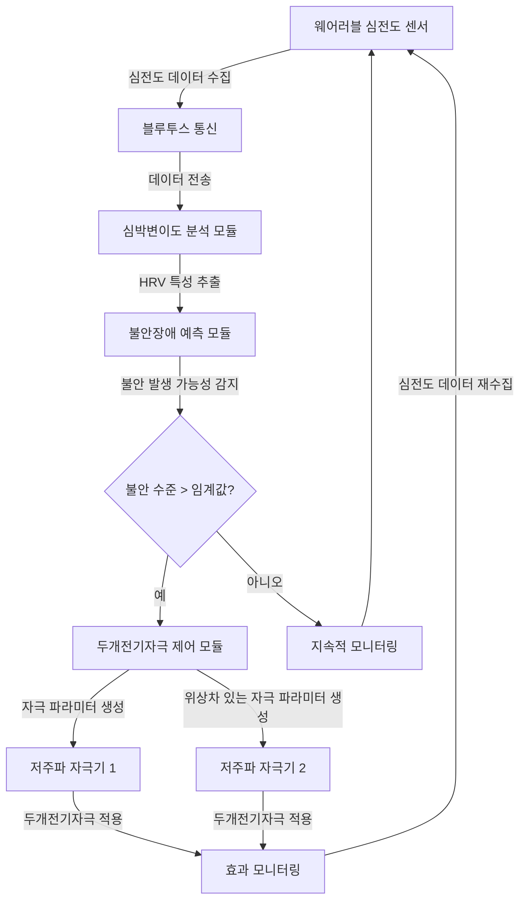
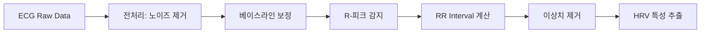
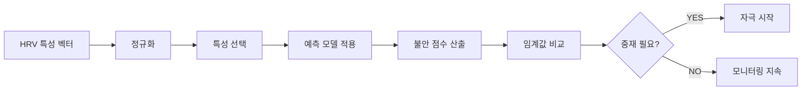
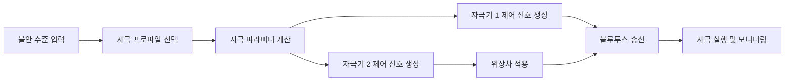

# 불안장애 예방장치 워크플로우

## 시스템 워크플로우 개요

아래는 불안장애 예방 시스템의 핵심 워크플로우입니다:

## 상세 워크플로우

### 1. 데이터 수집 단계
- 웨어러블 심전도 센서가 심전도(ECG) 신호를 지속적으로 측정
- 샘플링 속도: 250Hz (높은 정확도 HRV 분석을 위함)
- 블루투스 저에너지(BLE) 프로토콜을 통해 스마트폰 앱으로 실시간 데이터 전송
- 데이터는 5분 단위로 분석되며, 필요시 1분 단위 분석 가능

### 2. 심박변이도(HRV) 분석 단계
- R-피크 감지 알고리즘으로 심박 간격(RR interval) 추출
- 시간 영역 분석: SDNN, RMSSD, pNN50
- 주파수 영역 분석: VLF, LF, HF, LF/HF 비율
- 비선형 분석: Sample Entropy, 프랙탈 차원, DFA 알파1/알파2

### 3. 불안장애 예측 단계
- 특허 기술에 기반한 HRV 패턴 분석
- 기계학습 모델이 HRV 변수들을 입력으로 받아 불안 수준 점수 출력 (0-100점)
- 임계값 기반 트리거링 시스템:
  - 경고 수준(70-85): 사용자에게 알림, 호흡 운동 제안
  - 중재 수준(85+): 자동 두개전기자극 시작

### 4. 두개전기자극 제어 단계
- 자극 제어 파라미터 설정:
  - 주파수: 0.5-100Hz (최적값: 15-40Hz)
  - 펄스 폭: 50-200μs
  - 자극 강도: 0.5-4mA (사용자 조절 가능)
  - 자극 모드: 연속, 버스트, 랜덤 패턴
  - 자극 시간: 15-30분
  
- 스테레오 자극 제어(특허 10-2459338 기반)
  - 두 개의 자극기 동시 제어
  - 위상차: 0.1-1.0초 범위에서 조절 가능
  - 비대칭 자극: 각 자극기별 강도 독립 제어

### 5. 모니터링 및 피드백 단계
- 실시간 상태 모니터링: 
  - 심전도, HRV 지표, 불안 수준, 자극 상태
  - 모바일 앱 및 웹 대시보드에서 시각화
- 사용자 피드백 수집:
  - 주관적 불안 수준 보고
  - 자극 효과 평가
- 데이터 저장 및 분석
  - 로컬 및 클라우드 저장소에 데이터 저장
  - 장기 추세 분석 및 사용자별 최적 자극 패턴 조정

## 주요 기능별 세부 워크플로우

### ECG 신호 처리 워크플로우

### 불안 예측 워크플로우

### 자극기 제어 워크플로우

## 인터페이스 통신 규격

### ECG 센서 - 앱 통신 (BLE)
- 서비스 UUID: 0x180D (Heart Rate Service)
- 특성 UUID: 0x2A37 (Heart Rate Measurement)
- 데이터 포맷: [시간, 진폭, 샘플링 속도, 센서 상태]
- 최대 프레임 속도: 25 Hz

### 앱 - 자극기 통신 (BLE)
- 서비스 UUID: 0x1815 (Custom Service)
- 특성 UUID: 
  - 0x2A3A (Stimulation Control)
  - 0x2A3B (Stimulation Status)
- 제어 명령 포맷: [자극 모드, 주파수, 강도, 펄스 폭, 지속 시간, 위상]
- 상태 피드백 포맷: [동작 상태, 배터리 상태, 연결 품질, 오류 코드]

### 앱 - 서버 통신 (REST API)
- 엔드포인트: `/api/v1/data`
- 메소드: POST
- 요청 본문: JSON 형식의 심전도 및 HRV 데이터
- 응답: HTTP 200 (성공), 재분석된 불안 수준 점수
